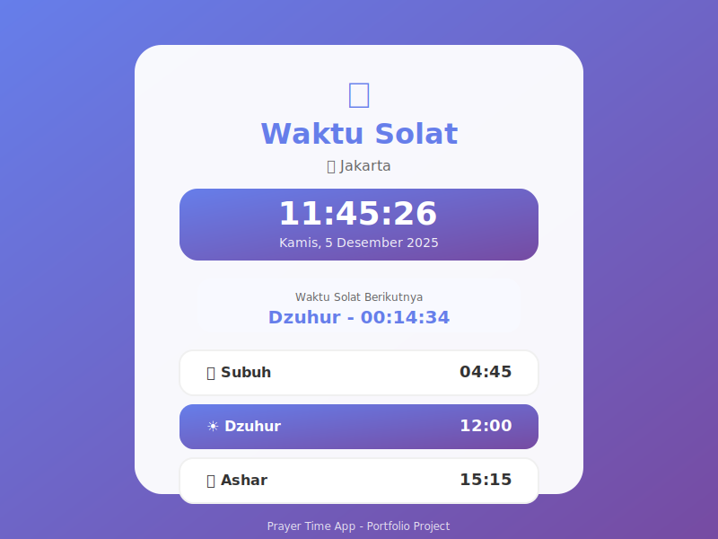

# 🕌 Prayer Time App - Waktu Solat Indonesia

Aplikasi waktu solat modern dengan tampilan yang indah dan fitur lengkap untuk umat Muslim di Indonesia.

## ✨ Fitur Utama

### 1. **Real-Time Clock** ⏰
- Jam digital yang update setiap detik
- Menampilkan tanggal lengkap dalam Bahasa Indonesia
- Format 24 jam

### 2. **Countdown Timer** ⏱️
- Hitung mundur ke waktu solat berikutnya
- Update real-time setiap detik
- Menampilkan jam, menit, dan detik

### 3. **Jadwal Solat Lengkap** 📅
- Subuh 🌙
- Dzuhur ☀️
- Ashar 🌤️
- Maghrib 🌅
- Isya 🌙

### 4. **Multi-City Support** 🌍
Mendukung 12 kota besar di Indonesia:
- Jakarta
- Surabaya
- Bandung
- Medan
- Semarang
- Makassar
- Palembang
- Tangerang
- Depok
- Bekasi
- Yogyakarta
- Malang

### 5. **Visual Indicator** 🎨
- Highlight waktu solat yang sedang aktif
- Gradient background yang menarik
- Animasi smooth transitions
- Responsive design

## 🎨 Design Features

- **Modern UI/UX**: Clean dan minimalist
- **Color Scheme**: Purple gradient (#667eea → #764ba2)
- **Typography**: Inter font family
- **Glassmorphism**: Backdrop blur effects
- **Animations**: Smooth slide-up entrance
- **Icons**: Font Awesome icons

## 🚀 Teknologi

- **HTML5**: Semantic markup
- **CSS3**: Modern styling dengan gradients, animations
- **Vanilla JavaScript**: No dependencies
- **Responsive**: Mobile-first design
- **SEO Optimized**: Meta tags lengkap

## 📱 Responsive Design

Aplikasi fully responsive untuk:
- ✅ Desktop (1920px+)
- ✅ Laptop (1024px - 1919px)
- ✅ Tablet (768px - 1023px)
- ✅ Mobile (320px - 767px)

## 🔧 Cara Penggunaan

1. **Pilih Kota**: Gunakan dropdown untuk memilih kota Anda
2. **Lihat Waktu**: Waktu solat akan otomatis ditampilkan
3. **Cek Countdown**: Lihat berapa lama lagi waktu solat berikutnya
4. **Real-time Update**: Jam dan countdown update otomatis

## 💡 Future Enhancements

Fitur yang bisa ditambahkan:
- [ ] Integrasi dengan Prayer Times API untuk akurasi lebih tinggi
- [ ] Notifikasi adzan
- [ ] Qibla direction compass
- [ ] Hijri calendar
- [ ] Dark mode toggle
- [ ] Audio adzan
- [ ] Bookmark favorite cities
- [ ] Widget mode

## 🌐 Live Demo

- **Standalone**: [prayer-time-app.html](prayer-time-app.html)
- **In Viewer**: [Via Portfolio Viewer](viewer.html?url=prayer-time-app.html&title=Prayer%20Time%20App)

## 📸 Screenshots



## 🎯 Use Cases

- Personal prayer reminder
- Mosque display screen
- Islamic center information board
- Mobile app prototype
- Portfolio project showcase

## 📝 Code Highlights

### Real-time Clock Update
```javascript
function updateCurrentTime() {
    const now = new Date();
    const timeString = now.toLocaleTimeString('id-ID');
    const dateString = now.toLocaleDateString('id-ID');
    // Update DOM
}
setInterval(updateCurrentTime, 1000);
```

### Countdown Calculation
```javascript
function updateCountdown() {
    const nextPrayer = getNextPrayer(prayerTimes);
    const diff = targetTime - now;
    // Calculate hours, minutes, seconds
    // Update countdown display
}
```

### City Selection
```javascript
document.getElementById('city-select').addEventListener('change', (e) => {
    loadPrayerTimes(e.target.value);
});
```

## 🤝 Contributing

Aplikasi ini open untuk improvement. Beberapa area yang bisa dikembangkan:
- API integration untuk waktu solat yang lebih akurat
- Geolocation untuk auto-detect kota
- PWA features untuk offline support
- Multi-language support

## 📄 License

MIT License - Feel free to use for personal or commercial projects

## 👨‍💻 Developer

Dibuat dengan ❤️ oleh [Portfolio](index.html)

---

**Note**: Waktu solat saat ini menggunakan perhitungan sederhana untuk demo. Untuk penggunaan real, disarankan mengintegrasikan dengan API seperti:
- Aladhan API
- Islamic Finder API
- Prayer Times API

## 🔗 Links

- [Back to Projects](projects.html)
- [Portfolio Home](index.html)
- [GitHub](https://github.com/ictfinger)
